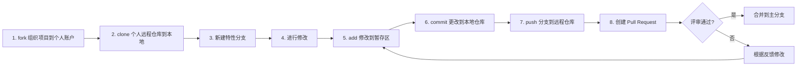

# 贡献指南

万事开头难。特别是和其他人合作时，出错往往会令人不适。不过，开源的本质就是和他人合作。这个项目的初衷就是为初学者提供一个简单的方法去学习以及参与开源项目。

你可以通过阅读文章和观看教程来得到帮助，但上手实操才是最好的学习方式。本项目旨在简化并指导初学者参与他们的第一次开源。如果你想要做出第一次贡献，只需按照以下简单步骤操作即可。这将会是一个很有趣的过程 :)

_如果你的电脑上未安装 git 或对命令行不熟悉，请参考以下的 [软件安装](#软件安装)。_


## 步骤



1.打开 [github](https://github.com/signup) 注册并登录，在 [想要修改的湖工商仓库](https://github.com/OpenHUTB/hutb) 页面点击`Fork`，然后点击`Create a new fork`，创建分叉到个人仓库。


**2.克隆个人仓库**（若出现SSL certificate problems请关闭加速器再克隆）：
```shell
# 注意：该命令中的 {用户名} 替换为自己的用户名，hutb 替换为想要修改的仓库名，否则没有权限直接修改组织仓库
git clone https://github.com/{用户名}/hutb.git
```


**3.新建特性分支**

在命令行窗口中把目录切换到仓库目录（比如.github）

```bash
cd .github
```
接下来使用 `git switch` 命令新建一个代码分支
```bash
git switch -c <新分支的名称>
```

(新分支的名称一般命名为想要增加的新特性。)

**4.修改仓库的文件**

打开任意文件，更新文件内容，保存修改。然后使用 `git status` 列出被改动的文件（后面步骤都可以使用该命令进行状态查看）。


**5-7**.修改并本地测试没问题后，**提交代码到个人仓库**（参考 git 命令说明）：
```shell script
git add README.md
git commit -m "update"
git push origin <新分支的名称>
```
将 `<新分支的名称>` 替换为之前新建的分支名称。

<details>
<summary> <strong>如果在 push（推送）过程中出 error（错误），点击这里</strong> </summary>

- ### Authentication Error
     <pre>remote: Support for password authentication was removed on August 13, 2021. Please use a personal access token instead.
  remote: Please see https://github.blog/2020-12-15-token-authentication-requirements-for-git-operations/ for more information.
  fatal: Authentication failed for 'https://github.com/<your-username>/first-contributions.git/'</pre>
  去 [GitHub's tutorial](https://docs.github.com/en/authentication/connecting-to-github-with-ssh/adding-a-new-ssh-key-to-your-github-account) 学习如何生成新的 SSH 密匙以及配置。

</details>

**8.** 在自己仓库的首页发现有提交领先于湖工商仓库的`main`分支，则点击`Contribute` 创建 [Pull Request](https://zhuanlan.zhihu.com/p/153381521) ，来湖工商仓库**做出贡献**，创建成功后等待管理员审核通过（如果发现个人仓库落后于湖工商仓库则点击`Sync frok`以同步其他人的最新修改）。


不久之后，团队成员便会把你所有的变化合并到这个项目的主分支。更改合并后，你会收到一封电子邮件通知。


**注意事项：**
- Pull Request 标题需要概括所修改的内容；
- 尽量少包含二进制文件；
- 不提交程序能够输出的中间文件、结果文件；
- 可以提供少量能够保证程序能够正常运行的示例数据，大的输入数据在 README.md 文件中提供百度网盘或者谷歌网盘的下载链接；


## 其他

1.同步子模块
```
git submodule update --remote
```

2.本地检查`Pull requests`请求
有人发送`Pull requests`时，可以在 GitHub 上合并之前[测试并验证更改](https://docs.github.com/zh/pull-requests/collaborating-with-pull-requests/reviewing-changes-in-pull-requests/checking-out-pull-requests-locally) 。


## 软件安装

- 下载相关[开发工具](https://pan.baidu.com/s/1Is2-VR1z-tMYvmdinsVY_g?pwd=hutb) ，先安装`Git-2.40.0-64-bit.exe`，再安装可视化工具管理 [`TortoiseGit-2.14.0.0-64bit.msi`](https://blog.csdn.net/xwnxwn/article/details/108694863)（可选）。

- [git 命令说明](https://blog.csdn.net/weixin_45682261/article/details/124003706) ；


- 使用其他工具的教程

| <a href="../gui-tool-tutorials/github-desktop-tutorial.md"></a> | <a href="../gui-tool-tutorials/github-windows-vs2017-tutorial.md"></a> |  <a href="../gui-tool-tutorials/github-windows-vs-code-tutorial.md"></a> |  <a href="../gui-tool-tutorials/github-windows-intellij-tutorial.md"></a> |
| --- | --- | --- | --- |
| [GitHub Desktop](../gui-tool-tutorials/github-desktop-tutorial.md) | [Visual Studio 2017](../gui-tool-tutorials/github-windows-vs2017-tutorial.md) |  [Visual Studio Code](./doc/pycharm-tutorial.md) | [Pycharm](../gui-tool-tutorials/github-windows-intellij-tutorial.md) |


## 问题

### 国内访问 github 可能较慢

这里提供 github 加速方案和科学上网的 [链接](https://openhutb.github.io/doc/build_carla/#internet) 。

### 向 github 上 push 的时候报 403 错误

打开`.git/config`，比如：
```
url = https://github.com/OpenHUTB/bazaar.git
```
将你用户名复制粘贴到github前面再加个@，变成：
```
url = https://OpenHUTB@github.com/OpenHUTB/bazaar.git
```
然后就可以进行授权并继续push。

### git push 报错unexpected disconnect while reading sideband packet

```shell
# 增加缓存至4G
git config --global http.postBuffer 4048576000
```


