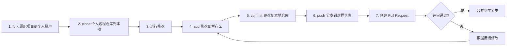

# 贡献指南

## 软件安装

1. 下载相关[开发工具](https://pan.baidu.com/s/1Is2-VR1z-tMYvmdinsVY_g?pwd=hutb) ，先安装`Git-2.40.0-64-bit.exe`，再安装可视化工具管理 [`TortoiseGit-2.14.0.0-64bit.msi`](https://blog.csdn.net/xwnxwn/article/details/108694863)（可选）。

- [git 命令说明](https://blog.csdn.net/weixin_45682261/article/details/124003706) ；


## 步骤



1.打开 [github](https://github.com/signup) 注册并登录，在 [想要修改的湖工商仓库](https://github.com/OpenHUTB/hutb) 页面点击`Fork`，然后点击`Create a new fork`，创建分叉到个人仓库。

2.克隆个人仓库（若出现SSL certificate problems请关闭加速器再克隆）：
```shell
# 注意：该命令中的 {用户名} 替换为自己的用户名，hutb 替换为想要修改的仓库名，否则没有权限直接修改组织仓库
git clone https://github.com/{用户名}/hutb.git
```

3.修改仓库的文件。

4-6.修改并本地测试没问题后，提交代码到个人仓库（参考 git 命令说明）：
```shell script
git add README.md
git commit -m "update"
git push
```

7.在自己仓库的首页发现有提交领先于湖工商仓库的`main`分支，则点击`Contribute`创建 [Pull Request](https://zhuanlan.zhihu.com/p/153381521) ，来湖工商仓库做出贡献，创建成功后等待管理员审核通过（如果发现个人仓库落后于湖工商仓库则点击`Sync frok`以同步其他人的最新修改）。

注意事项：
- Pull Request 标题需要概括所修改的内容；
- 尽量少包含二进制文件；
- 不提交程序能够输出的中间文件、结果文件；
- 可以提供少量能够保证程序能够正常运行的示例数据，大的输入数据在 README.md 文件中提供百度网盘或者谷歌网盘的下载链接；


## 其他

1.同步子模块
```
git submodule update --remote
```

2.本地检查`Pull requests`请求
有人发送`Pull requests`时，可以在 GitHub 上合并之前[测试并验证更改](https://docs.github.com/zh/pull-requests/collaborating-with-pull-requests/reviewing-changes-in-pull-requests/checking-out-pull-requests-locally) 。


## 问题

### 国内访问 github 可能较慢

这里提供 github 加速方案和科学上网的 [链接](https://openhutb.github.io/doc/build_carla/#internet) 。

### 向 github 上 push 的时候报 403 错误

打开`.git/config`，比如：
```
url = https://github.com/OpenHUTB/bazaar.git
```
将你用户名复制粘贴到github前面再加个@，变成：
```
url = https://OpenHUTB@github.com/OpenHUTB/bazaar.git
```
然后就可以进行授权并继续push。

### git push 报错unexpected disconnect while reading sideband packet

```shell
# 增加缓存至4G
git config --global http.postBuffer 4048576000
```


