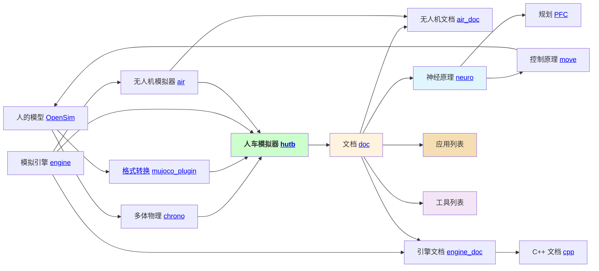
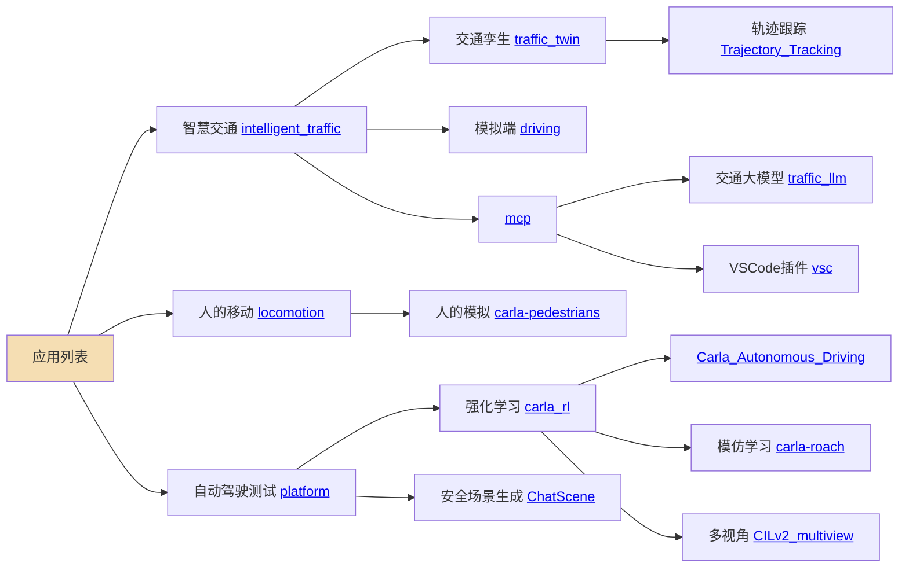
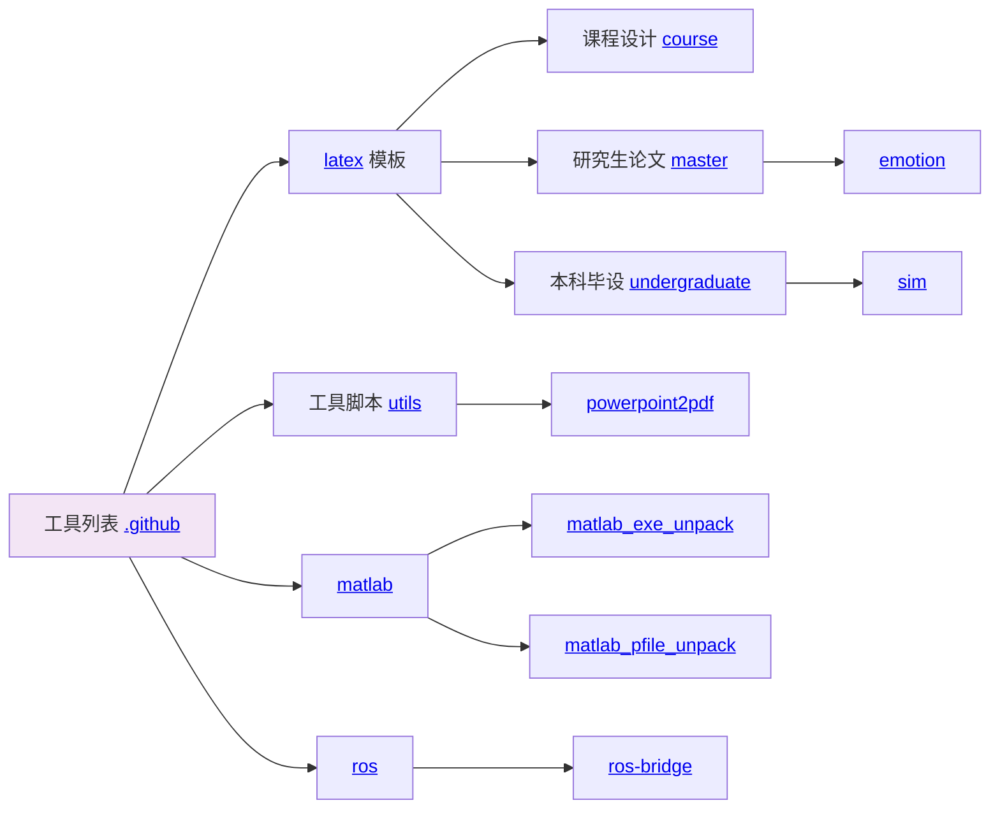

# OpenHUTB

该社区提供一个包含人车代理（学术研究）、模拟器（技术开发包括数据驱动、机理仿真、界面渲染）、现实场景（艺术增强）的 [模拟器](https://openhutb.github.io) ，代理包括[感知](https://openhutb.github.io/doc/algorithms/perception/) （连接）、[规划](https://openhutb.github.io/doc/algorithms/planning/) （符号）、[控制](https://openhutb.github.io/doc/algorithms/control/) （行为）；模拟器包括Python与C++的接口（正向创建、反向构建）、LibCarla、虚幻引擎插件；现实场景包括 [静态场景孪生](https://openhutb.github.io/doc/adv_digital_twin/) 、[动态场景孪生](https://github.com/OpenHUTB/traffic_twin/) 。
人车模拟器的技术架构入下图所示：

<!--所有项目关系的思维导图。-->
<!-- 使用markmap进行编辑并生成svg：https://markmap.js.org/repl -->
<!-- 在profile/markmap.md中保存图的数据 -->
<!-- svg图片预览：https://raw.githack.com/ -->

## 社区项目之间的关系

### 应用列表

### 工具列表

## 参考

🌈 第一次参与开源项目请参考 [贡献指南](./CONTRIBUTING.md)

🧙 记住，你可以利用 [Markdown](https://docs.github.com/github/writing-on-github/getting-started-with-writing-and-formatting-on-github/basic-writing-and-formatting-syntax) 撰写文档，减少沟通的认知障碍

👩‍💻 撰写论文请参考 [论文写作技巧](doc/paper_tips.md)

## 问题

- 修改代码请参考 [贡献指南](CONTRIBUTING.md) 。

- 如果参与过程中遇到任何问题，请参考 [注意事项](note.md) 或在对应项目的 [Issues页面](https://github.com/OpenHUTB/hutb/issues) 提出问题。

- 如有加入组织、添加项目、获得更高权限等需要请把github用户名发送到邮箱 [2929@hutb.edu.cn](2929@hutb.edu.cn) 。

- [搭建自定义开发环境](env_conf.md)

- 网络不稳定可以参考 [github 加速方案和科学上网链接](https://openhutb.github.io/doc/build_carla/#internet) 

