# 开源湖工商

该社区提供一个包含人车代理（学术研究）、模拟器（技术开发包括数据驱动、机理仿真、界面渲染）、现实场景（艺术增强）的 [模拟器](https://openhutb.github.io) ，代理包括[感知](https://openhutb.github.io/doc/algorithms/perception/) （连接）、[规划](https://openhutb.github.io/doc/algorithms/planning/) （符号）、[控制](https://openhutb.github.io/doc/algorithms/control/) （行为）；模拟器包括Python与C++的接口（正向创建、反向构建）、LibCarla、虚幻引擎插件；现实场景包括 [静态场景孪生](https://openhutb.github.io/doc/adv_digital_twin/) 、[动态场景孪生](https://github.com/OpenHUTB/traffic_twin/) 。

社区的技术架构：

<!--所有项目关系的思维导图。-->
<!-- 使用markmap进行编辑并生成svg：https://markmap.js.org/repl -->
<!-- 在profile/markmap.md中保存图的数据 -->
<!-- svg图片预览：https://raw.githack.com/ -->

项目之间关系：

```mermaid
graph LR
    A[人的肌肉骨骼 <a href='https://github.com/OpenHUTB/opensim-core'>OpenSim</a>] --> B[多体物体 <a href='https://github.com/OpenHUTB/chrono'>chrono</a>]
    B --> C[人车模拟器 <a href='https://github.com/OpenHUTB'>hutb</a>]
    A --> D[myoconverter]
    D --> E[mujoco]
    E --> F[<a href='https://github.com/OpenHUTB/mujoco_plugin'>mujoco_plugin</a>]
    F --> C
    C --> G[文档 <a href='https://github.com/OpenHUTB'>doc</a>]
    G --> H[无人机文档 <a href='https://github.com/OpenHUTB'>air_doc</a>]
    G --> I[神经原理 neuro]
    I --> J[规划 PFC]
    I --> K[控制原理 move]
    K --> A
    L[模拟引擎 <a href='https://github.com/OpenHUTB/engine'>engine</a>] --> C
    L --> M[引擎文档 engine_doc]
    G --> M
    L --> N[无人机模拟器 <a href='https://github.com/OpenHUTB/air'>air</a>]
    N --> C
    N --> H
    G --> O[社区支持.github,latex]
    G --> Q[工具 matlab, pfile, powerpoint2pdf]
    P[C++ 文档 cpp] --> M
    C --> R[应用 traffic_twin, locomotion]

    style B fill:#e1f5fe
    style C fill:#ccffcc
    style D fill:#fff3e0
    style E fill:#f3e5f5
    style F fill:#F5DEB3
```

## 参考

🌈 第一次参与开源项目请参考 [贡献指南](./CONTRIBUTING.md)

🧙 记住，你可以利用 [Markdown](https://docs.github.com/github/writing-on-github/getting-started-with-writing-and-formatting-on-github/basic-writing-and-formatting-syntax) 撰写文档，减少沟通的认知障碍

👩‍💻 撰写论文请参考 [论文写作技巧](doc/paper_tips.md)

## 问题

- 修改代码请参考 [贡献指南](CONTRIBUTING.md) 。

- 如果参与过程中遇到任何问题，请参考 [注意事项](note.md) 或在对应项目的 [Issues页面](https://github.com/OpenHUTB/hutb/issues) 提出问题。

- 如有加入组织、添加项目、获得更高权限等需要请把github用户名发送到邮箱 [2929@hutb.edu.cn](2929@hutb.edu.cn) 。

- [搭建自定义开发环境](env_conf.md)

- 网络不稳定可以参考 [github 加速方案和科学上网链接](https://openhutb.github.io/doc/build_carla/#internet) 

