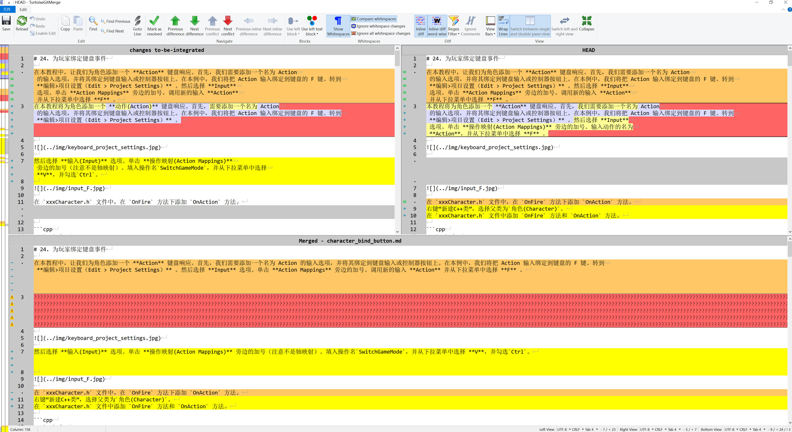

# 使用 TortoiseGit 解决冲突

在发生冲突的文件中，冲突区域会有标记，比如：
```shell
<<<<<<< yours
    你当前工作区的代码
=======
    合并过来的代码
>>>>>>> their
```

可以使用任何编辑器手动解决冲突，也可以通过 TortoiseGit 提供的菜单解决冲突：选中冲突文件，在右键菜单中选择`TortoiseGit` → `Edit Conflicts` ，启动外部合并工具/冲突编辑器手动解决冲突。





左边文件为:远程仓库的文件，右边为本地文件(也就是你当前修改的文件)；
下边的文件是你合并操作后的文件。

在合并处,鼠标右击:

1. Use text block from left:使用远程库的代码
2. Use text block from right:使用本地的代码
3. Use text block from right before left:
远程库和本地文件的代码都保留,且本地库的代码放在上面,远程库的代码放在下面

    Use text block from left before right:
远程库和本地文件的代码都保留,且本地库的代码放在下面,远程库的代码放在上面

最后,点击Mark as resolved 和Save按钮即可(如果冲突比较多,就点击Next difference一个个排查解决冲突即可)。

## 参考


* [使用小乌龟TortoiseGit快速解决代码冲突问题](https://blog.csdn.net/qq_34550459/article/details/108438031)
* [TortoiseGit 入门指南06：解决冲突](https://blog.csdn.net/zhzht19861011/article/details/131715372)

