# 基于浏览器的贡献指南

**1.** **[注册](https://openhutb.github.io/.github/dev/sign_up/) 并登陆 Github 账号**，在 [想要修改的开源孪创仓库](https://github.com/OpenHUTB/hutb) 页面右上角点击`Fork`

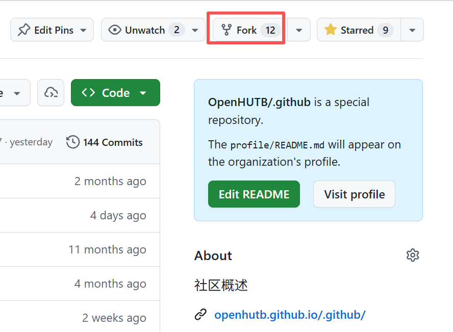

在弹出的页面点击`Create fork`，**创建分叉**到个人仓库。

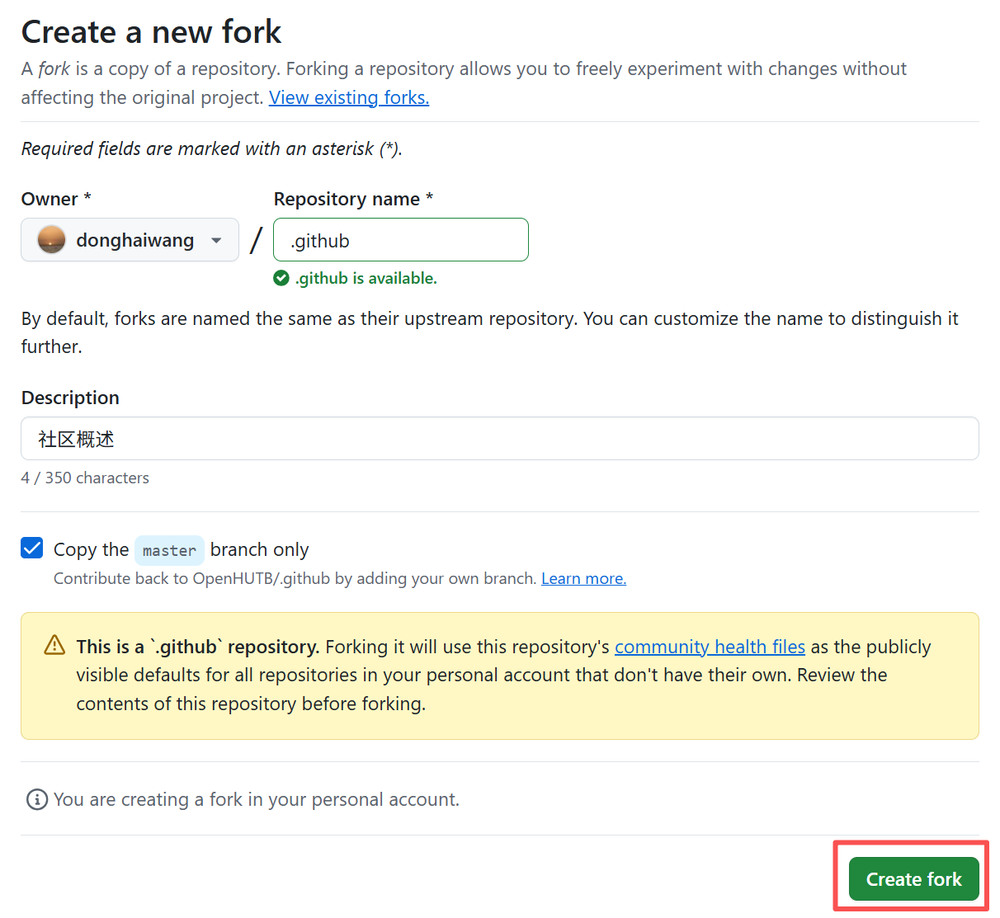

出现的页面即为社区仓库的拷贝。

**2. 启用自动化流水。**

点击个人项目的“Actions -> I understand my workflows, go ahead and enable them”启用自动化流水。

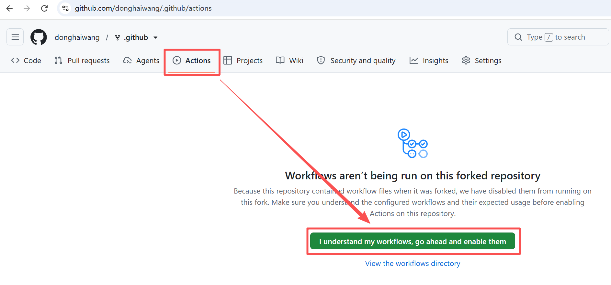

点击“Settings -> Action -> General -> Workflow permissions -> read and write permissions” 启用项目的 Action 写入权限。

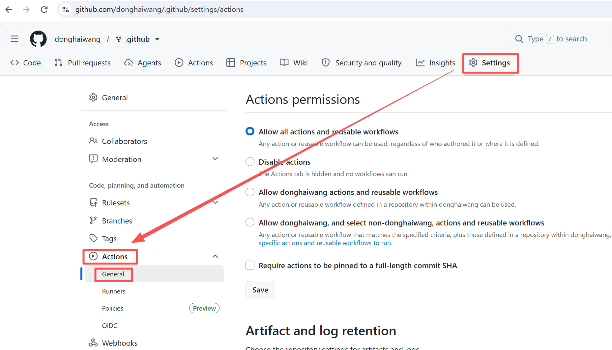

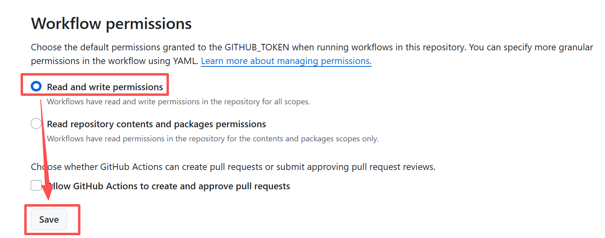

**3. 修改项目** 

点击“Code -> Create codespace on master”创建在线编辑器
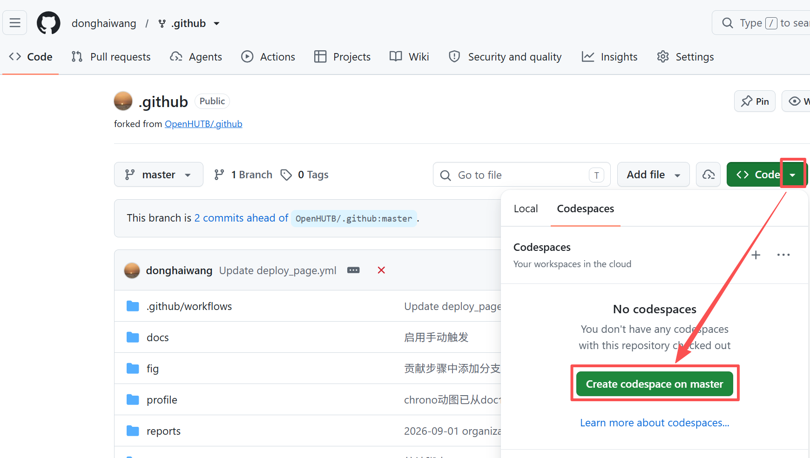

等待一会儿，就可以在浏览器中显示 VSCode 编辑器打开的项目，点击“信任文件并继续”

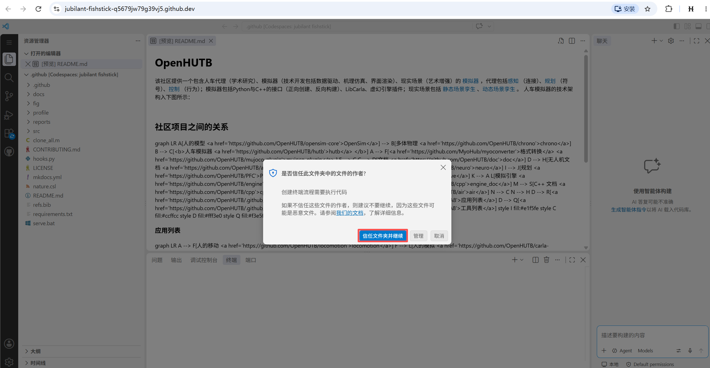

点击左边“资源管理器”中的文件，并在中间进行编辑。点击编辑区右上角的“Open Preview to the side”来打开修改的预览

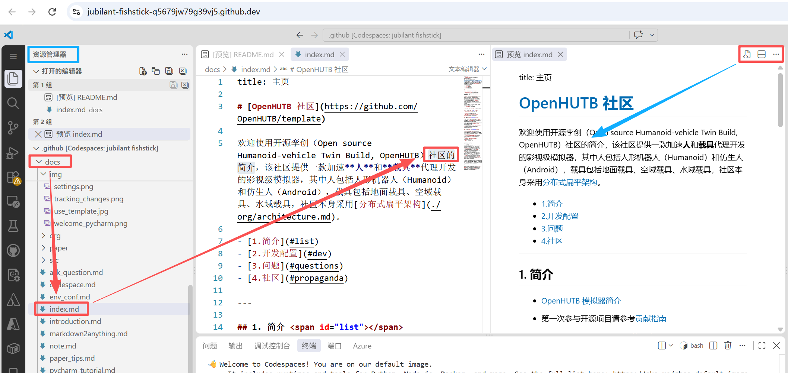

**4. 提交修改**

点击左侧分叉图标的“源代码管理”，弹出提交页面。
点击更改的内容，确认中间的工作树对比中（左侧为修改之前的内容，右侧为修改之后的内容）的修改为想要修改的内容。再填写提交信息，点击“提交”。

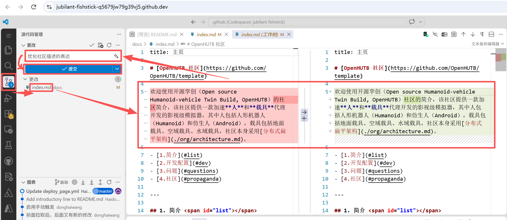

然后点击“同步更改”，将提交推送到个人仓库的主分支 origin/master。这时左侧“图表”中多了一项刚才提交的内容。

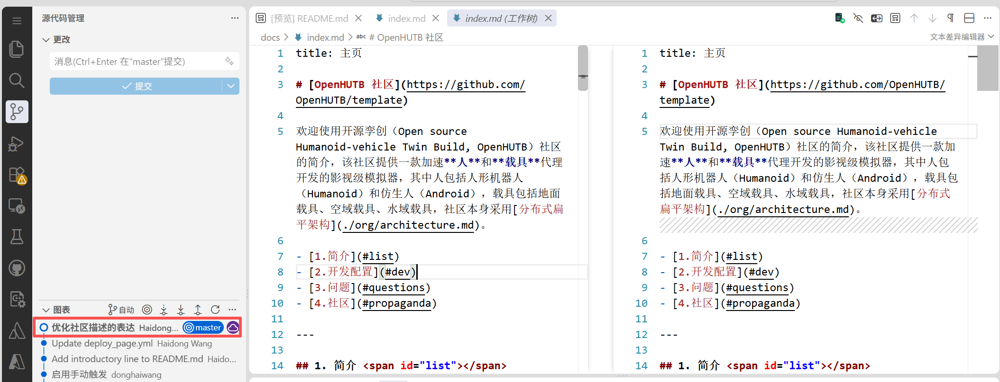

**5. 检查**修改内容的正确性

回到仓库页面，发现有内容领先于开源孪创社区分支（commits ahead of OpenHUTB/.github:master）

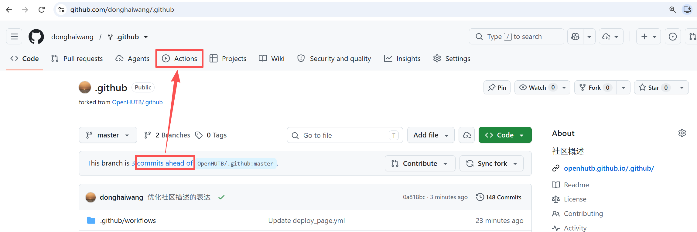

在 Actions 页面也会自动出现编译成功的绿色提示

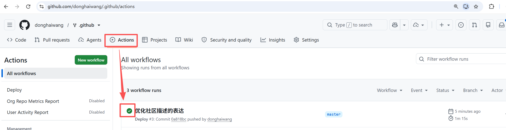

点击“Settings -> Pages -> Branch -> None -> gh-pages -> Save” 部署生成的 gh-pages 分支（网页文件），该步骤只需要执行一次
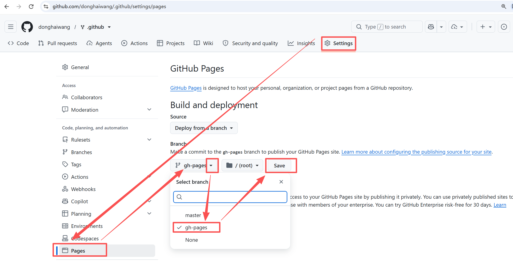

点击“Actions”查看部署链接：

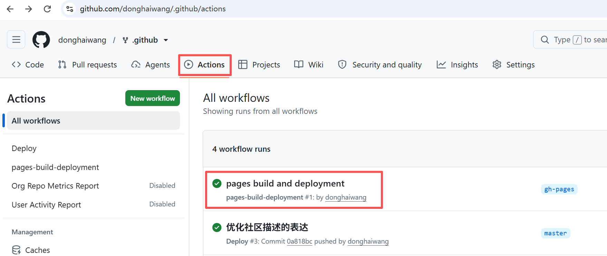

点击部署的链接（后面部署该链接都不变）

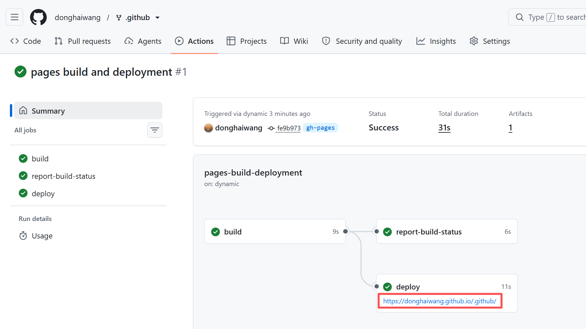

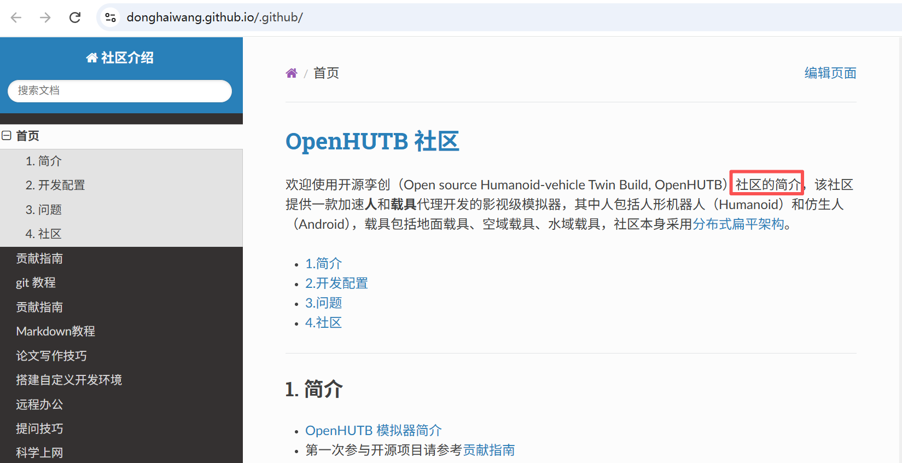

**6. 创建 Pull Request**

在项目主页点击“Contribute -> Open pull request”

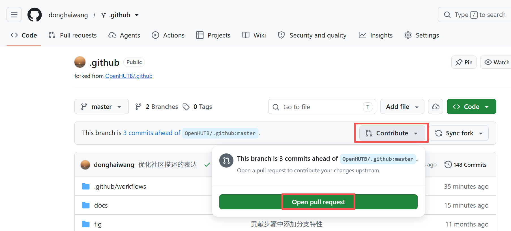

填写标题和详细描述信息，点击“Crete pull request”

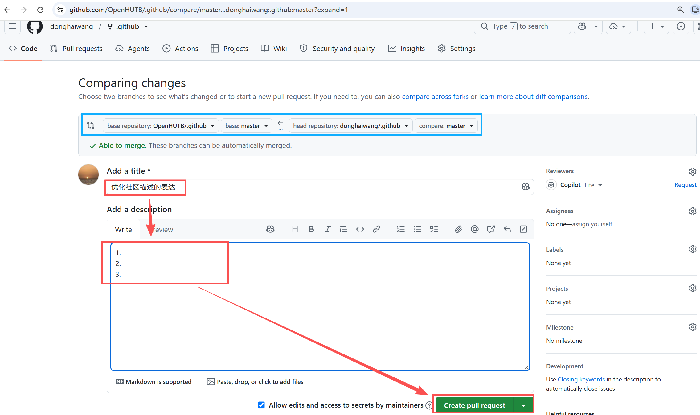

将会跳转到社区仓库的 Pull Request 页面，等待其他人评论。如果其他人提出问题，则继续第 [3](#edit) 步的 vscode 编辑。如果没问题，则会通过并合并到主分支，随后就可以在社区的代码库和页面中看到修改的内容。

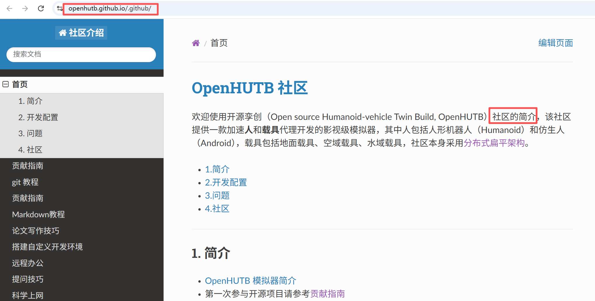

