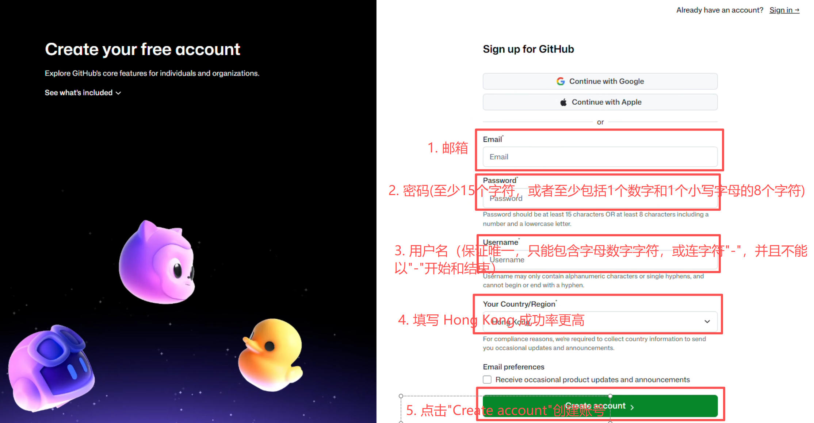

# 注册 Github 账号

1. 首先进入 [github 官网的注册页面](https://github.com/signup)（Sign up），Sign in 是登录；

2. 填写自己常用邮箱（比如 [QQ](https://mail.qq.com/)、[163](https://mail.163.com/)、[Gmail](https://mail.google.com/mail?hl=zh-CN) 等邮箱，并且保证手机能够提醒新邮件）、密码、用户名等信息，然后用邮箱验证即可完成。

## 异常情况

* 点击“Create account”后需要进行一个验证过程，保证是真人，而不是 AI

    解决：继续验证，可以选择图片验证，可以选择声音验证，可能会有延迟，但是按照步骤一步一步来，直到验证通过。

* 如果出现“Unable to verify your captcha response...”问题

    解决：尝试使用不同的网络环境、不同邮箱、不同设备进行注册。

* 如果还是不能解决
    
    解决：在注册页面直接选择 Continue with Google，使用 Google 账号注册，就可以完成注册（请参考[Google 账号注册页面](https://www.google.com/intl/zh-CN/account/about/)，注意这种方法需要[科学上网](https://openhutb.github.io/doc/build_carla/#internet)）。

