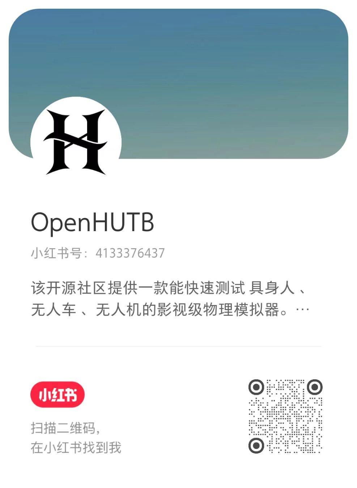

title: 主页

# [OpenHUTB 社区介绍](https://github.com/OpenHUTB/template)

欢迎使用 OpenHUTB 的社区简介文档。

- [简介](#list)
- [问题](#questions)

---

## 1. 简介 

- [OpenHUTB 模拟器简介](./simulator.md)

- 第一次参与开源项目请参考 [贡献指南](./CONTRIBUTING.md)

- [git 教程](https://openhutb.github.io/git/?locale=zh_CN)、[Python教程（到第13章）](https://liaoxuefeng.com/books/python/introduction/index.html)、[C++教程](https://www.runoob.com/cplusplus/cpp-tutorial.html)

- 记住，自始至终，你可以利用 [Markdown](https://docs.github.com/zh/get-started/writing-on-github/getting-started-with-writing-and-formatting-on-github/basic-writing-and-formatting-syntax) 撰写文档，减少沟通的认知障碍。

- [开源工具列表](./tools.md)。

- 撰写论文请参考 [论文写作技巧](./paper_tips.md)

## 2. 开发配置

- [搭建自定义开发环境](env_conf.md)

- [合并提交](dev/merge_commit.md)

- [免费开源远程办公解决方案：rustdesk+tailscale](rustdesk_tailscale.md)

## 2. 问题 

- 如果参与过程中遇到任何问题，请参考 [提问技巧](./ask_question.md) 和 [注意事项](note.md) 或在对应项目的 [Issues页面](https://github.com/OpenHUTB/hutb/issues) 提出问题。

- 如有加入组织、添加项目、获得更高权限等需要请把github用户名发送到邮箱 [2929@hutb.edu.cn](2929@hutb.edu.cn) 。

- 网络不稳定可以参考 [github 加速方案和科学上网链接](https://openhutb.github.io/doc/build_carla/#internet) 

## 3. 社区  

- [用户的社区参与度月度统计情况](https://github.com/OpenHUTB/.github/actions) - 该 action 页面的 User Activity Report 里，每月1号自动进行统计，注意，该量化统计情况仅作参考，不代表代码质量的优劣

- [社区每个仓库的月度变化统计情况](https://github.com/OpenHUTB/.github/tree/master/reports)

- [Markdown 一键发到各个社交平台](./markdown2anything.md)

OpenHUTB 的社交平台：

|  |  |  |  |
|:---:|:---:|:---:|:---:|
|  |  |  | |
| [微信公众号](https://mp.weixin.qq.com/mp/profile_ext?action=home&__biz=MzI2ODk5MzE5Ng==) | 微信 | [知乎](https://www.zhihu.com/people/OpenHUTB)  | [B 站](https://space.bilibili.com/479231494) |
|  |  |  | |
| [小红书](https://www.xiaohongshu.com/user/profile/62977010000000002102bc47) | [Twitter(X)](https://x.com/OpenHUTB) | [Youtube](https://www.youtube.com/@OpenHUTB)  |  |

___

如果对文档中的任何问题可以在 [本文档的源码仓库](https://github.com/OpenHUTB/templte) 中的 [问题](https://github.com/OpenHUTB/templte/issues) 页面讨论或者提交 [拉取请求](https://github.com/OpenHUTB/.github/blob/master/CONTRIBUTING.md) 直接修改文档。

