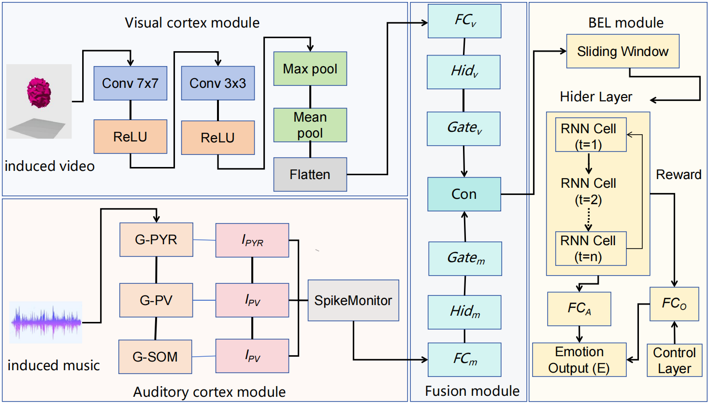
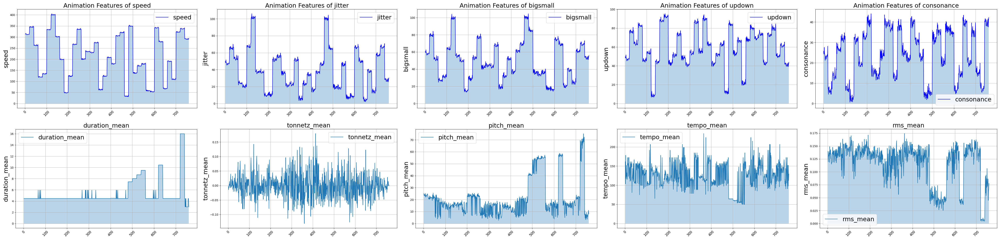
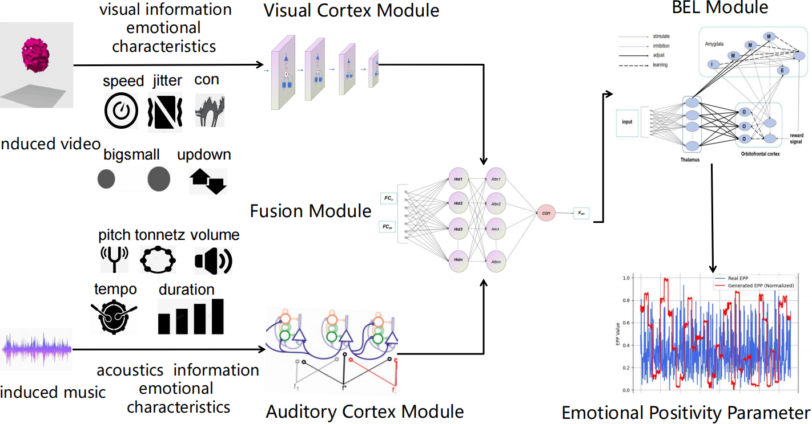
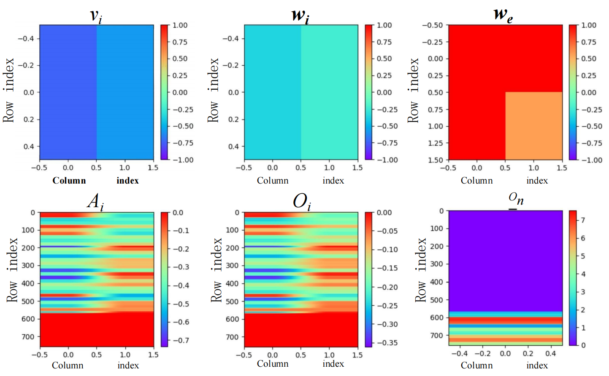
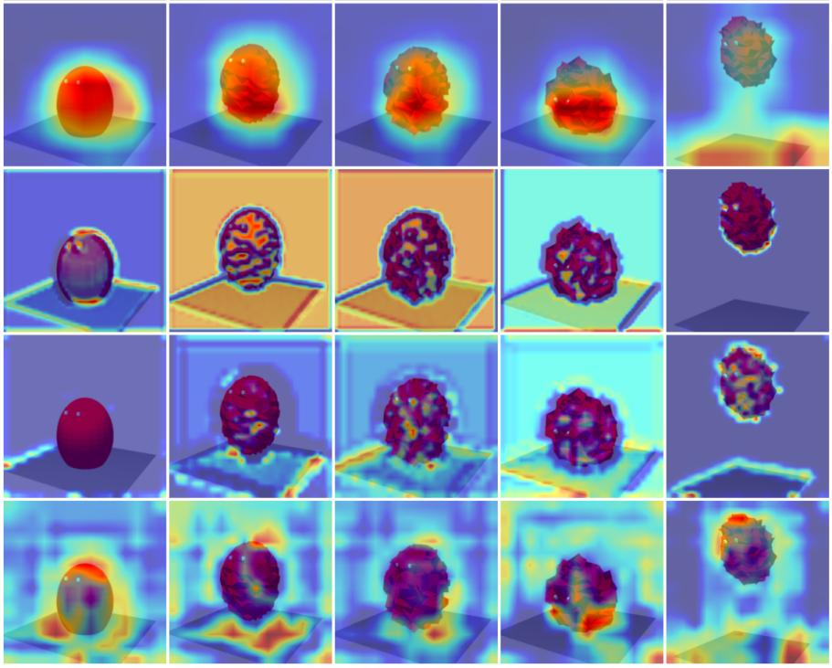
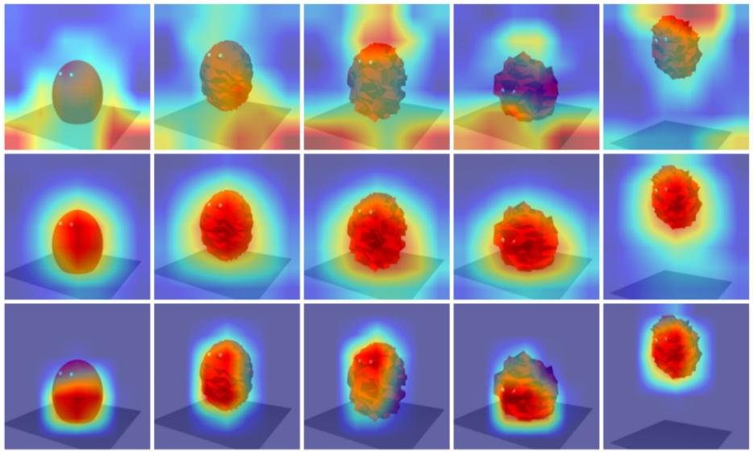
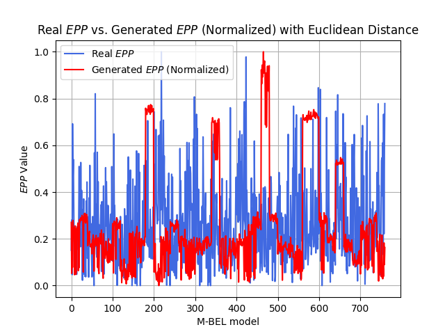
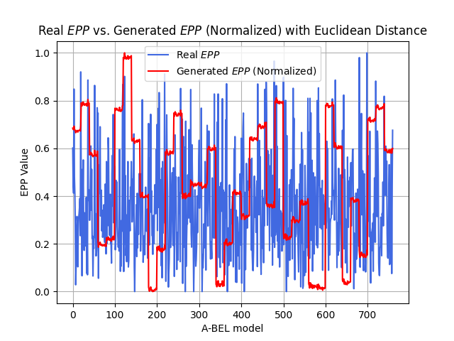
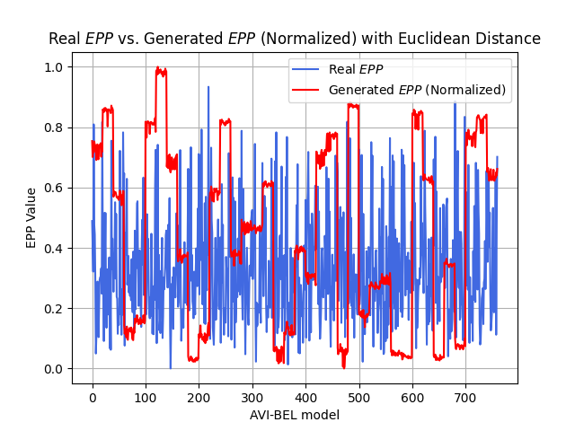

# 如何让机器像人一样融合视听信息来“感受”情绪？

当 AI 能精准识别图片、能流畅对话，我们似乎已经习惯了它“无所不能”。但一个根本性的挑战依然存在：**AI 能理解人类的情绪吗？**

目前主流的方案，无论是基于深度学习还是大模型，往往依赖于海量标注数据和巨大的算力。它们更像一个“黑箱”，虽然有效，却**很难解释“为什么”**。这让我们在追求可解释、低成本的 AI 情感应用时，总感到有些力不从心。

来自 OpenHUTB 的研究团队，在人工智能领域顶级国际期刊《Information Fusion》上发表的最新研究成果，或许提供了一条全新的思路。他们提出的**类脑情感学习的视听融合**（Audio-Visual Fusion for Brain-like Emotion Learning, AVF-BEL）模型，不再单纯依赖数据“暴力计算”，而是选择了一条更优雅的路——**模仿大脑处理情感的神经通路**。

## 核心思想：向大脑学习“通感”

人类的情感体验，往往是多感官融合的结果。一段悲伤的音乐配合灰暗的画面，远比单独的音乐或画面更能触动我们。这种**视听整合**发生在大脑的颞上沟等区域。

情绪生成神经网络架构图（动态情绪响应的视觉和听觉处理）

AVF-BEL 模型的核心理念，就是在计算模型中模拟这条从感知到情感的神经通路。它并非一个简单的大模型，而是一个精巧的模块化架构，包含四个核心部分：

1. **视觉皮层模块**：基于 CORnet-Z 模型，模拟视觉腹侧通路（V1, V2, V4, IT 区），从动画中提取与情绪相关的视觉特征（如运动速度、抖动、大小变化等）。

2. **听觉皮层模块**：构建了一个包含兴奋性（锥体细胞）和抑制性（PV、SOM 中间神经元）的简化脉冲神经网络，从音乐中提取声学特征（如音高、音量、节奏等）。

听觉和视觉情感特征表征

3. **多模态融合模块**：模仿颞上沟的功能，通过门控机制动态调整视听信息的权重，将两者有效整合。

4. **情感学习与生成模块（BEL）**：基于经典的脑情感学习模型，模拟杏仁核和眶额皮层之间的相互作用，通过“神经基线约束奖励”机制，学习并最终生成一个衡量情绪积极程度的数值——情绪积极度参数（EPP） 。

AVF-BEL 模型架构

## 亮点与优势：轻量、可解释

与动辄百亿参数、需要 GPU 集群的多模态大模型（如 ViLBERT、CLIP）相比，AVF-BEL 模型展现出了独特的魅力：

* **极致轻量**：整个模型总参数量仅约 208 万，其中核心的情感学习模块更是只有 8 个可训练的权重。它可以在普通 CPU（如 Intel i7-6500U）和 8GB 内存的电脑上运行，整个代码和数据包不足 50MB。

模型权重矩阵的热力图

* **高可解释性**：模型的每个模块都能对应到具体的脑区功能。例如，通过 Grad-CAM 可视化，可以清晰地看到其视觉模块从 V1 到 IT 区，关注区域从边缘轮廓逐步聚焦到与情绪相关的物体核心区域，这与灵长类视觉腹侧通路的处理机制高度吻合。

| 基于梯度的可视化 (Grad-CAM) | 注意力权重可视化 |
|:---:|:---:|
|  |  |

* **性能验证**：在一个包含 1520 个视听情绪样本的数据集上，完整的 AVF-BEL 模型在预测 EPP 的准确率（0.79）、召回率（0.77）和 F1 分数（0.78）上，均显著优于仅使用单模态或缺少融合模块的变体模型，证明了视听融合的有效性。

| M-BEL 中的相似度比较 | A-BEL 中的相似度比较 | AVF-BEL 中的相似度比较 |
|:---:|:---:|:---:|
|  |  |  |

## 应用展望：为情感 AI 的“飞入寻常百姓家”铺路

AVF-BEL 模型的成功，其意义不仅在于提出一个新模型，更在于指明了**机器人情感生成领域一个可能的重要发展方向**。它证明了，通过向生物智能“取经”，我们完全有可能打造出**更高效、更易于理解**的情感AI系统。这为情感计算技术在资源受限的移动端、嵌入式机器人、以及隐私敏感的边缘设备上的大规模部署，扫清了关键障碍。

未来，研究团队计划进一步整合海马体、前额叶皮层等更多类脑模块，搭建一座**连接“人工神经网络”与“生物神经网络”的桥梁**。通过这座桥梁，可以从计算的视角，去验证、质疑并最终加深对我们自己大脑的理解。或许在不远的将来，我们身边的智能设备不再是一堆冰冷的代码，而是真正能“读懂”我们情绪的伙伴。
