# 远程办公解决方案：tailscale（免费）+rustdesk（开源）

## 1. 把多台机器放进同一个虚拟局域网

* [注册tailscale](https://login.tailscale.com/start)并在需要远程登录的机器上下载对应操作系统版本的[tailscale](https://tailscale.com/download/windows)进行安装。

> 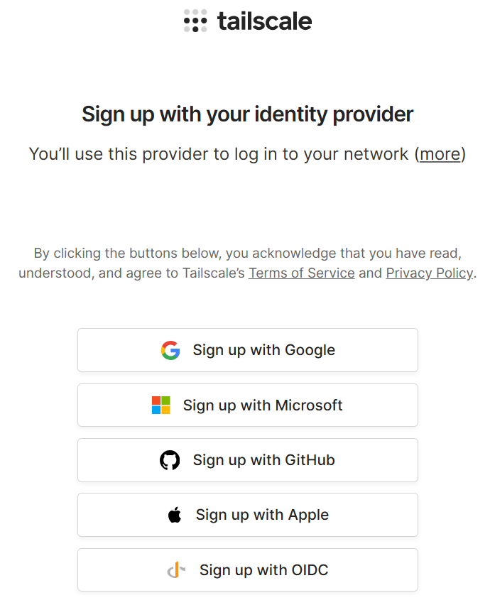

* 将本机加入到虚拟局域网中

> 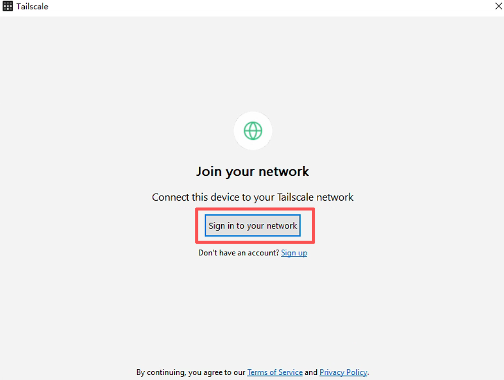

> 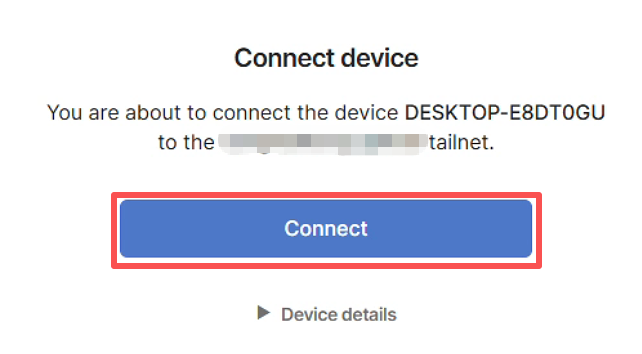

* 将设备添加到同一网络中（添加后就可以在[tailscale后台](https://console.tailscale.com/admin/machines)进行管理。
可以将key设置成永久，防止过段时间需要重新登录）
> 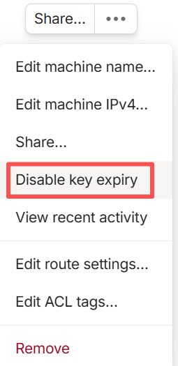

> 启动软件后会点击`sign in to your network`
> 

> 以 github 授权使用为例
> 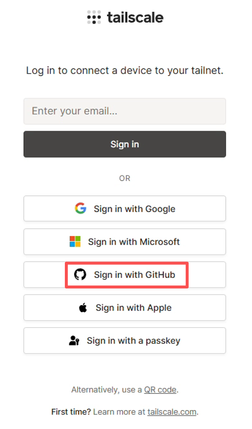
> 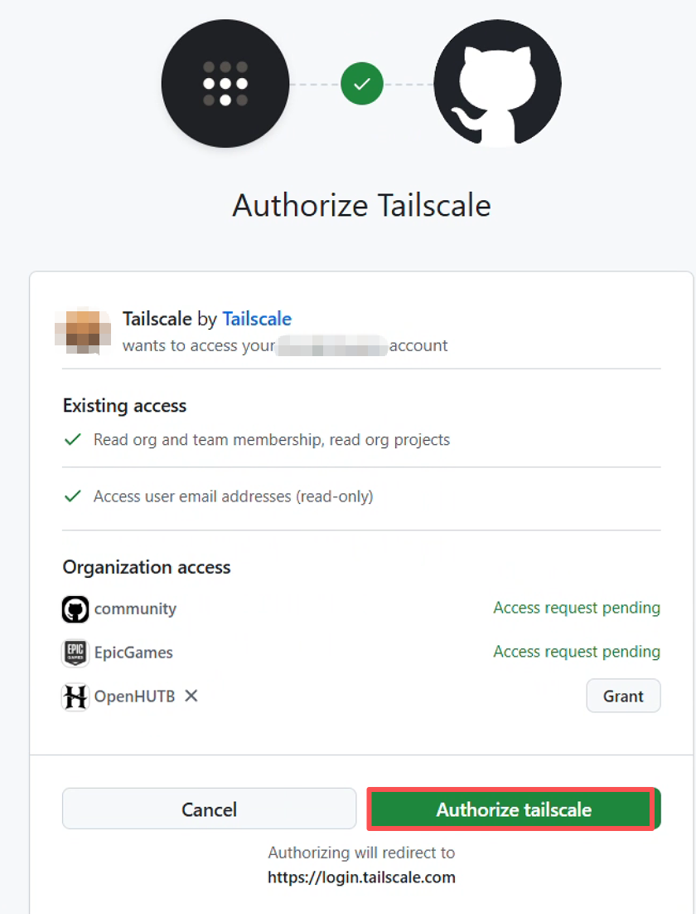

> 提示登录成功后，点击`visit the console`访问控制台，就可以看到已加入虚拟局域网的设备列表
> 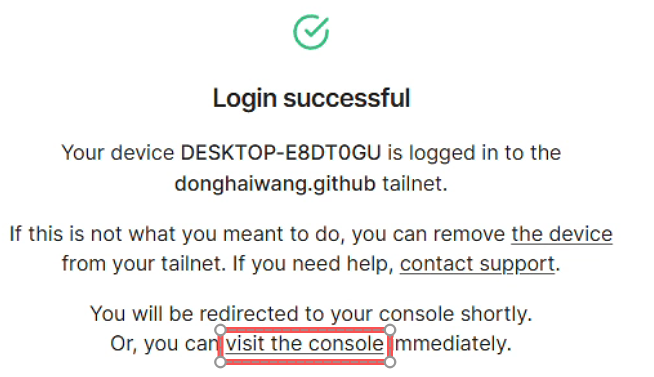

## 2. Windows远程登录

在被控机上启用 Windows 远程桌面连接

> 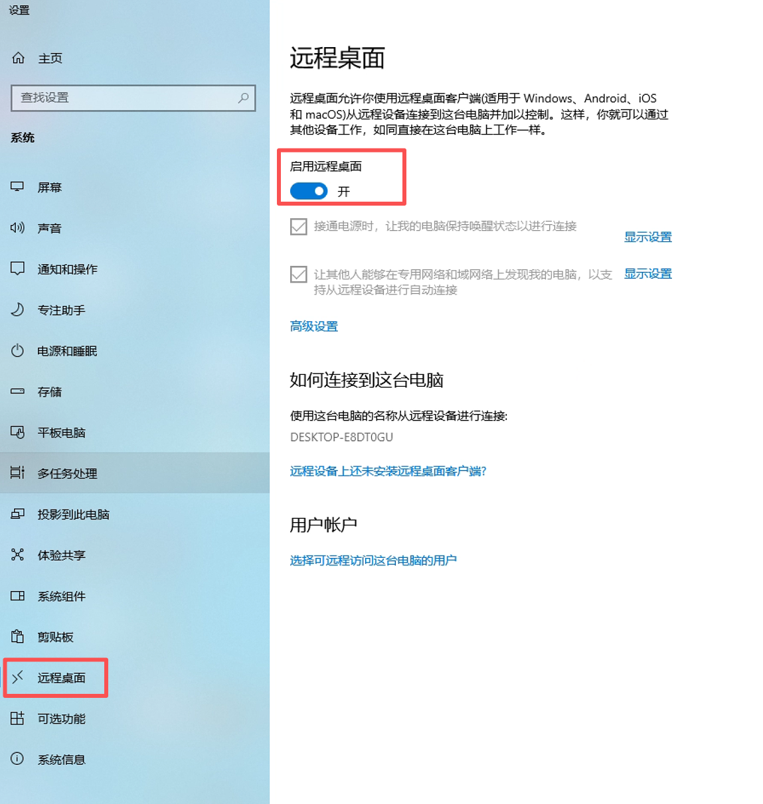

如果远程的机器为 Windows，只需要打开本地电脑的`远程桌面连接`，使用 tailscale 的 IP 地址（将图中的型号`*`换成自己的IP地址），输入Windows系统的用户名/密码即可登录。
> 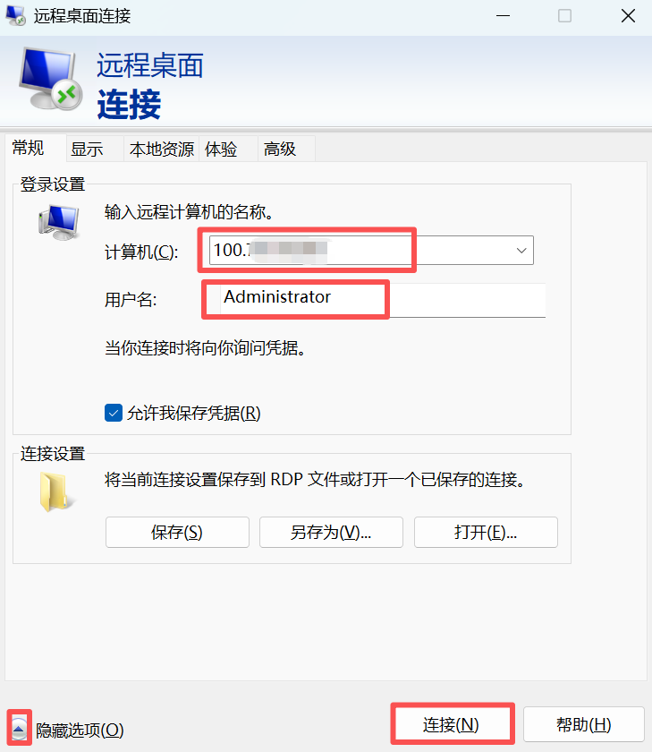

!!! 注意
    如果使用 windows 这一步登录成功，后面的“RustDesk配置与连接”就不再需要。如果是 Ubuntu、Mac、Android、iOS等其他平台，请查看后面的“RustDesk配置与连接”。

## 附：RustDesk配置与连接

* [下载](https://github.com/rustdesk/rustdesk/releases)并安装RustDesk客户端。

* 控制端/被控端：打开RustDesk，设置->解锁安全设置->勾选“允许IP直接访问”

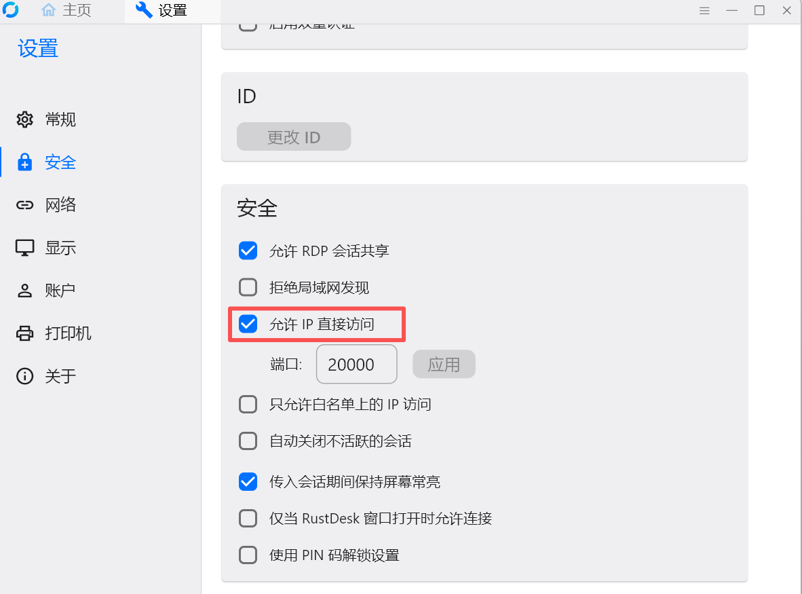

输入被控端的 IP 地址即可远程登录（注意这里是 Tailscale IP，不是台式机的IP ）。

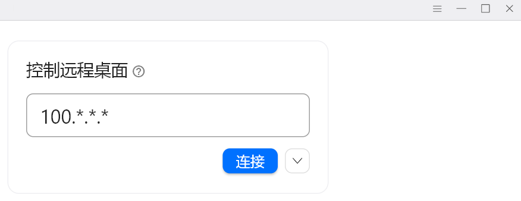

!!! 问题
    如果连接时报错：`连接错误 Failed to connect to 100.*.*.*:21118:请稍后再试`，确认被控端下面是否有“服务未运行”的提示，如果有请点击“启动服务”，然后再次连接即可。

## 高级操作

### 邀请其他成员进入虚拟局域网

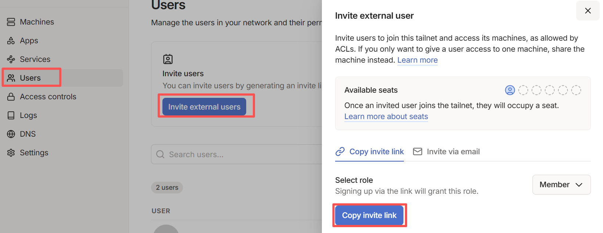

## 参考

* [使用 Tailscale 实现内网穿透+RDP远程控制](https://www.cnblogs.com/lefour/p/18866579)

