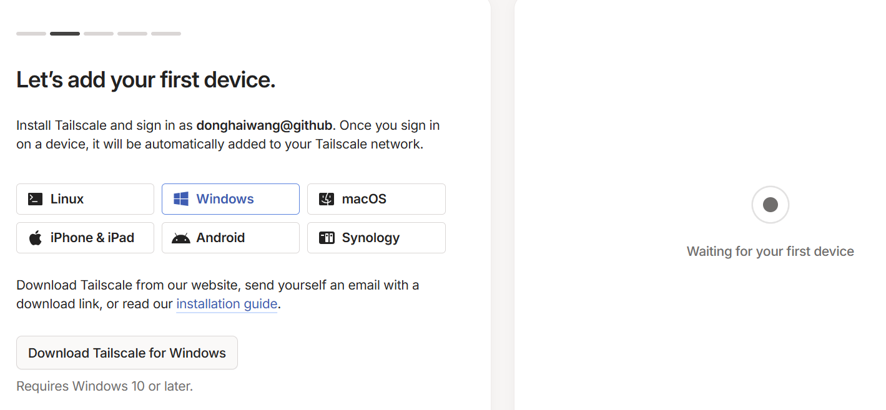

# 免费远程办公解决方案：tailscale+rustdesk

## 1. tailscale安装与配置
1.[注册tailscale](https://login.tailscale.com/start) 并在需要远程登录的机器上下载[tailscale](https://tailscale.com/download/windows) 安装。

并将设备添加到同一网络中

3.添加后就可以在[tailscale后台](https://console.tailscale.com/admin/machines)进行管理。
可以将key设置成永久，防止过段时间需要重新登录。

## 2. Windows远程登录

如果远程的机器为 Windows，只需要打开本地电脑的远程登录，使用 tailscale 的 IP 地址，输入Windows系统的用户名/密码即可登录，后面的“RustDesk配置与连接”就不再需要。

如果是 Ubuntu、Mac、Android、iOS等其他平台，请查看后面的“RustDesk配置与连接”。

## 附：RustDesk配置与连接

1.[下载](https://github.com/rustdesk/rustdesk/releases)并安装RustDesk客户端。

2.控制端/被控端：打开RustDesk，设置->解锁安全设置->勾选“允许IP直接访问”

输入被控端的 IP 地址即可远程登录（注意这里是 Tailscale IP，不是台式机的IP ）。

<!-- 
设置->网络->ID/中继服务器

IP服务器，IP为 Tailscale 穿透提供的 IP，KEY为上面自托管完成后生成的文件：C:\rustdesk-server-windows-x64\id_ed?????.pub，打开文件复制粘贴

注意： 控制端和被控端两边都必须填写相同的 ID 服务器地址和 Key

本地：100.126.226.12
远程：100.87.198.103
-->

## 参考

* [使用 Tailscale 实现内网穿透+RDP远程控制](https://www.cnblogs.com/lefour/p/18866579)

