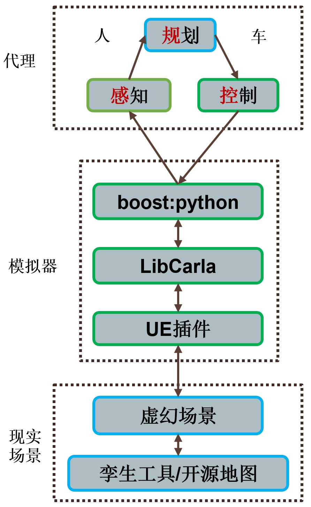

```mermaid
# 调试： https://mermaid.js.org/intro/
# 文档： https://mermaid.js.org/syntax/flowchart.html
flowchart LR
    subgraph 现实数据
    地图/孪生工具-->场景
    场景-->地图/孪生工具
    end
    UE插件-->场景
    场景-->UE插件
    subgraph 模拟器
    LibCarla-->UE插件
    UE插件-->LibCarla
    LibCarla-->boost::python
    boost::python-->LibCarla
    end
    控制-->boost::python
    boost::python-->感知
    subgraph 人/车代理
    规划-->控制 
    感知-->规划
    end
```


<!--
<div align=left>

<a href="https://github.com/OpenHUTB/.github">



</a>

</div>
-->


<!--

**Here are some ideas to get you started:**

🙋‍♀️ A short introduction - what is your organization all about?
🌈 Contribution guidelines - how can the community get involved?
👩‍💻 Useful resources - where can the community find your docs? Is there anything else the community should know?
🍿 Fun facts - what does your team eat for breakfast?
🧙 Remember, you can do mighty things with the power of [Markdown](https://docs.github.com/github/writing-on-github/getting-started-with-writing-and-formatting-on-github/basic-writing-and-formatting-syntax)
-->
