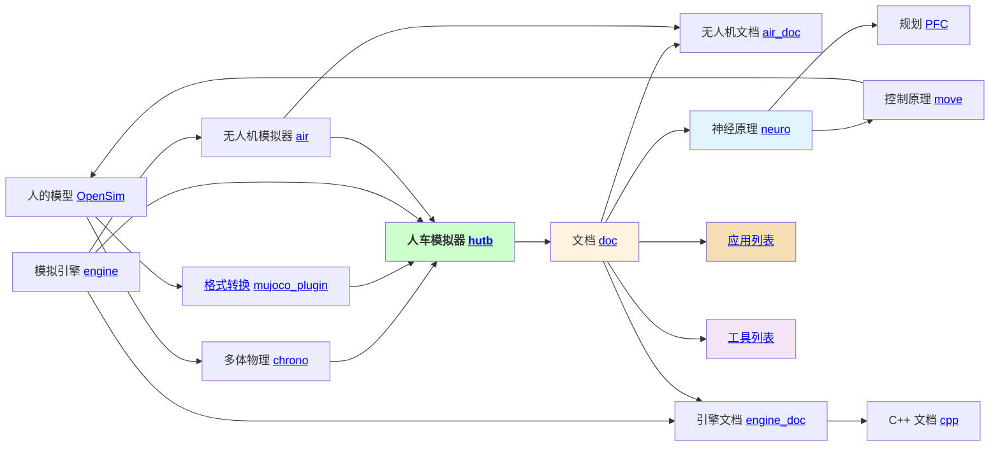

🙋‍♀️ 该社区提供一款能快速测试 [具身人](https://openhutb.github.io/doc/#_4) 、[无人车](https://openhutb.github.io/doc/#_5) 、[无人机](https://openhutb.github.io/air_doc/) 感知、规划、控制算法的影视级物理模拟器。

   

🍿 实用资源 - 从 [社区文档](https://openhutb.github.io/doc/) 中可以找到您所需要的所有详细信息，项目之间的关系如下图所示

🌈 贡献指南 - 欢迎在各个项目的 [Issues 页面](https://github.com/OpenHUTB/hutb/issues) 进行交流，参与社区请参考 [贡献指南](https://github.com/OpenHUTB/.github/blob/master/CONTRIBUTING.md) 

<!--

**Here are some ideas to get you started:**

🙋‍♀️ A short introduction - what is your organization all about?
🌈 Contribution guidelines - how can the community get involved?
👩‍💻 Useful resources - where can the community find your docs? Is there anything else the community should know?
🍿 Fun facts - what does your team eat for breakfast?
🧙 Remember, you can do mighty things with the power of [Markdown](https://docs.github.com/github/writing-on-github/getting-started-with-writing-and-formatting-on-github/basic-writing-and-formatting-syntax)
-->
