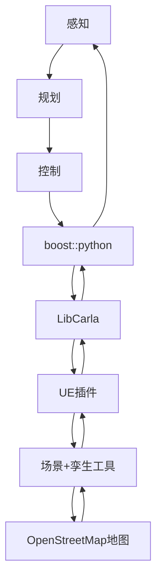

```mermaid
graph TD;
    感知-->规划;
    规划-->控制;
    boost::python-->感知;
    控制-->boost::python;
    boost::python-->LibCarla
    LibCarla-->boost::python
    UE插件-->LibCarla
    LibCarla-->UE插件
    场景+孪生工具-->UE插件
    UE插件-->场景+孪生工具
    OpenStreetMap地图-->场景+孪生工具
    场景+孪生工具-->OpenStreetMap地图
```